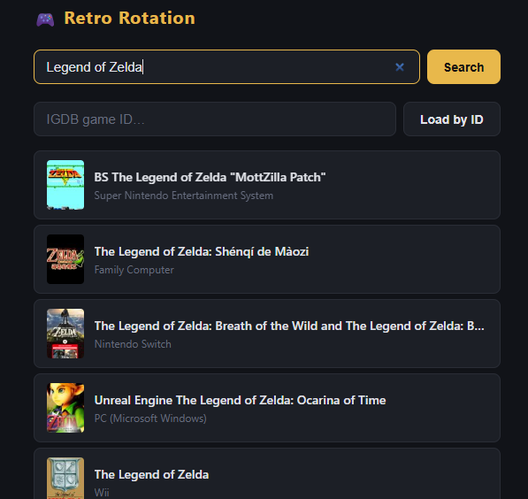
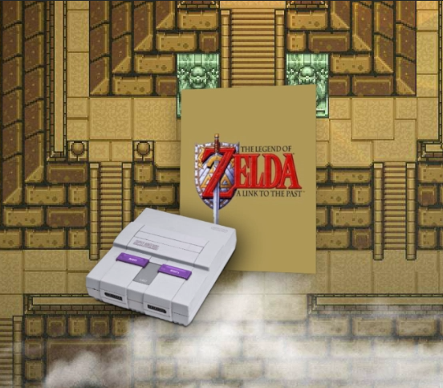

# Retro Rotation

An OBS browser source overlay that displays retro game cover art alongside a matching console image. Search for any game via the operator control panel and the display updates live.

Control Panel  



OBS Display  



---

## Prerequisites

- [Node.js](https://nodejs.org/) 18 or later
- A [Twitch Developer](https://dev.twitch.tv/console) account (used to authenticate against the IGDB API)

## Setup

1. **Clone and install dependencies**

   ```bash
   git clone <repo-url>
   cd retro-rotation
   npm install
   ```

2. **Configure environment variables**

   Copy `.env.example` to `.env`:

   ```bash
   cp .env.example .env
   ```

   Open `.env` and fill in your Twitch credentials:

   ```
   TWITCH_CLIENT_ID=your_client_id
   TWITCH_CLIENT_SECRET=your_client_secret
   ```

   To get these credentials:
   1. Go to [https://dev.twitch.tv/console](https://dev.twitch.tv/console) and log in.
   2. Click **Register Your Application**.
   3. Set the OAuth Redirect URL to `http://localhost`.
   4. Set the Category to **Other**.
   5. Copy the generated **Client ID** and create a **New Secret**.

3. **Start the server**

   ```bash
   # Production
   node server.js

   # Development (auto-restarts on file changes)
   npx nodemon server.js
   ```

   The server starts on port 3000 by default. To use a different port, set `PORT` in `.env`.

## OBS Setup

1. In OBS, add a **Browser Source** to your scene.
2. Set the URL to `http://localhost:3000/display`.
3. Match the width and height to your canvas resolution (e.g. 1920×1080).
4. Enable **Shutdown source when not visible** to free resources when the scene is inactive.
5. Check **Refresh browser when scene becomes active** so the overlay reconnects on scene switch.

The display page has a transparent background and is designed to be composited over other sources.

## Usage

Open the control panel at `http://localhost:3000` in any browser.

- **Search** for a game by title. Results come from the IGDB database and require a valid `.env` configuration.
- **Select** a game to set it as "now playing". The OBS overlay updates immediately.
- **Override the console** using the dropdown if the auto-detected platform is wrong or if you want to display a different console image.
- **Clear** the current game to hide the overlay.

State is held in memory — it resets when the server restarts.

---

## Architecture

The app has two pages served by a single Express server (`server.js`):

| Page | URL | Purpose |
|---|---|---|
| Control panel | `http://localhost:3000/` | Operator UI to search games and set "now playing" |
| OBS overlay | `http://localhost:3000/display` | Browser source that renders in OBS |

### State flow

```
Control panel
  └─ POST /api/current
       └─ src/sse.js  (in-memory state)
            └─ broadcasts to all SSE clients
                 └─ display page re-renders
```

When the operator selects a game, the control panel POSTs the full game object to `/api/current`. The server stores it in memory and fans it out to every connected display page via [Server-Sent Events](https://developer.mozilla.org/en-US/docs/Web/API/Server-sent_events). The display page opens a persistent SSE connection on load and re-renders whenever it receives a new event — no polling, no WebSockets.

On first load the display page calls `GET /api/current` to sync immediately, then opens `GET /api/events` to receive future updates. A 25-second heartbeat keeps the connection alive through proxies and load balancers.

### IGDB integration (`src/igdb.js`)

IGDB uses Twitch's OAuth layer. A token is fetched on first search, cached in memory, and refreshed automatically before it expires. All queries use [Apicalypse](https://apicalypse.io/) syntax sent as a plain-text POST body.

### Platform mapping (`src/platforms.js`)

`PLATFORM_MAP` maps IGDB platform IDs to PNG filenames in `public/consoles/`. When a game is returned from IGDB, the server walks the game's platform list and picks the first one that has a matching entry in `PLATFORM_MAP`. The operator can override this at any time from the control panel dropdown without affecting the underlying game data.

---

## Adding a Console

1. **Add the PNG** to `public/consoles/`. The filename should be lowercase and hyphenated, e.g. `ps3.png`.

2. **Map the IGDB platform ID** in `src/platforms.js`:

   ```js
   // src/platforms.js
   const PLATFORM_MAP = {
     // ...existing entries...
     9: 'ps3',   // 9 is the IGDB ID for PlayStation 3
   };
   ```

   To find an IGDB platform ID, search for the platform at [https://www.igdb.com](https://www.igdb.com) and note the numeric ID in the URL, or use the [IGDB API docs](https://api-docs.igdb.com/#platform).

3. **Add it to the override dropdown** in the same file:

   ```js
   const PLATFORM_CONSOLE_IMAGE_MAP = [
     // ...existing entries...
     { label: 'PlayStation 3', consoleName: 'ps3' },
   ];
   ```

   `consoleName` must exactly match the PNG filename (without the `.png` extension).

No server restart is required for PNG changes, but restarting is needed for `platforms.js` changes to take effect.
